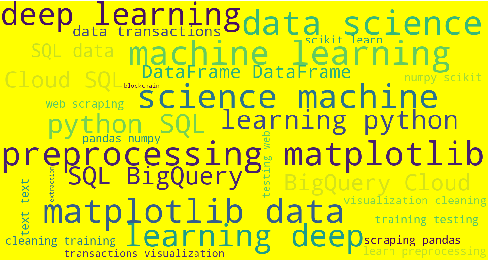
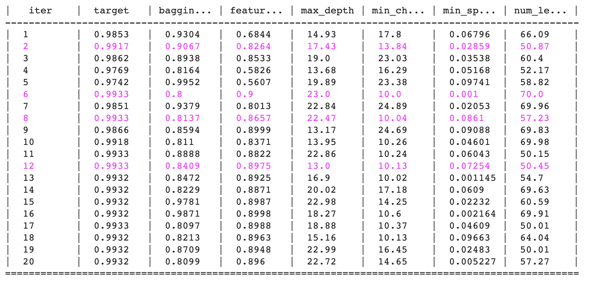
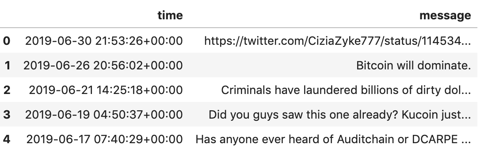

---

# [Medium Files](https://github.com/dc-aichara/DS-ML-Public/tree/master/Medium_Files)

## 1. [hyp_tune.ipynb](https://github.com/dc-aichara/DS-ML-Public/blob/master/Medium_Files/hyp_tune.ipynb)

- A notebook to guide hyperparameters optimization using Bayesian model based optimization. 

Example hyperparameters optimization results table for LightGBM Regressor on Boston Housing data. 



Read complete article on [Medium](https://medium.com/analytics-vidhya/hyperparameters-optimization-for-lightgbm-catboost-and-xgboost-regressors-using-bayesian-6e7c495947a9). 

## 2. [Bar_Plot_Animation.py ](https://github.com/dc-aichara/DS-ML-Public/blob/master/Medium_Files/Bar_Plot_Animation.py)
- Creates animation of bar plots using matplotlib python package <br>
[Read complete tutorial on Medium](https://medium.com/@dc.aichara/making-animated-bar-plots-of-top-16-cryptocurrencies-market-capitalization-price-and-volume-7889788af264)<br>
[Watch animation on YouTube](https://www.youtube.com/watch?v=jqSuaRpCnro) <br>
[](http://www.youtube.com/watch?v=jqSuaRpCnro)

## 3. [telegram.py](https://github.com/dc-aichara/DS-ML-Public/blob/master/Medium_Files/telegram.py)
- Telegram chat data extraction and data processing <br>
[Medium Tutorial](https://medium.com/@dc.aichara/telegram-channel-data-extraction-users-information-chats-and-specific-messages-and-data-21bb54710fd3)  <br>

> An example of telegram chats which contain keyword 'bitcoin' or 'btc'


## 4. [Bitcoin_messages_telegram.py](https://github.com/dc-aichara/DS-ML-Public/blob/master/Medium_Files/Bitcoin_messages_telegram.py)
- Get text messages from telegram groups and channels which contain word 'bitcoin' or 'btc'. <br>

Example: 

```python
>>> tele_btc_messages.head()

```


## 5. [telegram_user_status.py](https://github.com/dc-aichara/DS-ML-Public/blob/master/Medium_Files/telegram_user_status.py)
- Use to get users who were online in last 24 hours.

Example: 
```
$ cd DS-ML-Public
$ python telegram_user_status.py 12345 fe3922d77g6wgwgwyu35g46c9 bitgrit
Number of active users in last 24 hours is 1530.
          User               status
0  Dayal Chand               online
1       Sameer             recently
2  Dikesh Shah  2019-07-02 01:13:19
3       Crypto  2019-07-02 00:47:50
4        Billy  2019-07-02 01:32:49

```
## 6. [GA.ipynb](https://github.com/dc-aichara/DS-ML-Public/blob/master/Medium_Files/GA.ipynb)

- A  Jupyter Notebook for Google Analytics Reporting API tutorial. 

## 7. [dashboard_demo](https://github.com/dc-aichara/DS-ML-Public/blob/master/Medium_Files/dashboard_demo/)

- A dashboard demo app  

*** 

## [WebScrapers](https://github.com/dc-aichara/DS-ML-Public/tree/master/WebScrapers) 

## 1. [lok_sabha_results.py](https://github.com/dc-aichara/DS-ML-Public/blob/master/WebScrapers/lok_sabha_results.py)
- Get [Lok Sabha elections 2019 results](https://results.eci.gov.in/pc/en/partywise/index.htm) using web scraping technique with requests and BeautifulSoup python packages. 

## 2. [crypto_news_scraper.py](https://github.com/dc-aichara/DS-ML-Public/blob/master/WebScrapers/crypto_news_scraper.py)
- Python script to extract cryptocurries related news from [CoinDesk](https://www.coindesk.com), [Cointelegraph](https://cointelegraph.com) and [cryptonewsz](https://www.cryptonewsz.com). 

### Usages
$ git clone https://github.com/dc-aichara/DS-ML-Public.git <br>
$ cd DS-ML-Public/WebScrapers <br>
$ python3 

```python
>>> from crypto_news_scraper import NewsScrap
>>> news = NewsScrap()
>>> df_coindesk = news.coin_desk_news()
>>> df_coindesk.head()
  category                                            heading  ...                time    source
0     news  Dapp.com Closes $1 Million Investment Round Le...  ... 2019-09-06 22:00:00  CoinDesk
1     news  Telegram Finally Releases Code for Its $1.7 Bi...  ... 2019-09-06 21:46:00  CoinDesk
2     news  Massive $1 Billion Bitcoin Whale Transaction M...  ... 2019-09-06 19:00:00  CoinDesk
3     news  Ethereum Picks Early October for Testnet Activ...  ... 2019-09-06 18:00:00  CoinDesk
4     news  Dapp Data Site DappRadar Raises $2.33 Million ...  ... 2019-09-06 17:00:00  CoinDesk

[5 rows x 6 columns]
>>> df_cointelegraph = news.cointelegraph_news()
>>> df_cointelegraph.head()
  category                                            heading  ...                 time         source
0     News  Crypto and Blockchain Adoption Grows: 5 Import...  ...  2019-09-09 11:15:03  CoinTelegraph
1     News  World’s ‘First’ Blockchain Smartphone to Becom...  ...  2019-09-09 08:15:03  CoinTelegraph
2     News  Ethereum's Istanbul Hard Fork Implementation D...  ...  2019-09-09 08:15:03  CoinTelegraph
3     News  Blockchain Startup DappRadar Raises $2.33M Fro...  ...  2019-09-09 08:15:03  CoinTelegraph
4     News  Huobi’s Research Arm to Partner with the Unive...  ...  2019-09-09 07:15:03  CoinTelegraph

[5 rows x 6 columns]
>>> df_all = news.get_all_news()
Getting news from CoinDesk!!
Getting news from Cointelegraph!!
Getting news from cryptonewsz!! This will take 1-2 mintues. 😉
>>> df_all.head()
  category                                            heading  ...                 time    source
0     news  Dapp.com Closes $1 Million Investment Round Le...  ...  2019-09-06 22:00:00  CoinDesk
1     news  Telegram Finally Releases Code for Its $1.7 Bi...  ...  2019-09-06 21:46:00  CoinDesk
2     news  Massive $1 Billion Bitcoin Whale Transaction M...  ...  2019-09-06 19:00:00  CoinDesk
3     news  Ethereum Picks Early October for Testnet Activ...  ...  2019-09-06 18:00:00  CoinDesk
4     news  Dapp Data Site DappRadar Raises $2.33 Million ...  ...  2019-09-06 17:00:00  CoinDesk

[5 rows x 6 columns]

```
## 3. [inshorts_news_scraper.py](https://github.com/dc-aichara/DS-ML-Public/blob/master/WebScrapers/inshorts_news_scraper.py)

### Usages
$ git clone https://github.com/dc-aichara/DS-ML-Public.git <br>
$ cd DS-ML-Public/WebScrapers <br>
$ python3 

```python
>>> from inshorts_news_scraper import InshortsNews
>>> news = InshortsNews('business')
>>> df_b = news.get_news()
>>> df_b.head()
                                            headings                                               news       short_by                time  category
0  BSNL plans to fire 30% contract staff unpaid s...  BSNL is reportedly planning to lay off about 3...  Anushka Dixit 2019-09-09 23:35:00  business
1  SAT overturns SEBI's 2 year-ban on PwC in ₹7,8...  The Securities Appellate Tribunal (SAT) on Mon...  Anushka Dixit 2019-09-09 21:29:00  business
2  Nissan CEO Hiroto Saikawa to step down on Sept...  Nissan CEO Hiroto Saikawa will step down on Se...         Dharna 2019-09-09 21:08:00  business
3  British Airways pilots begin 2-day strike over...  British Airways pilots began a two-day strike ...  Anushka Dixit 2019-09-09 20:18:00  business
4  SEBI making e-voting app for retail investors ...  Markets regulator SEBI is working on an e-voti...         Dharna 2019-09-09 18:04:00  business
>>> df_all = news.get_all_news()
>>> df_all.head()
                                            headings                                               news        short_by                time  category
0  Conflict between India, Pak less heated now th...  Speaking about tensions between India and Paki...  Arshiya Chopra 2019-09-10 08:50:00  national
1  Bengaluru woman loses ₹95,000 after calling fa...  A Bengaluru woman lost ₹95,000 after calling a...  Pragya Swastik 2019-09-10 08:25:00  national
2  IAS officer who resigned is traitor, should go...  BJP MP Anantkumar Hegde has called IAS officer...    Apaar Sharma 2019-09-09 23:28:00  national
3  Stop drama, stand up, CISF allegedly tells wom...  Virali Modi, a disability rights activist, has...    Anmol Sharma 2019-09-09 23:10:00  national
4  Tech firms may be allowed to sell users' publi...  India is reportedly mulling guidelines which w...          Dharna 2019-09-09 23:00:00  national

```
## 4. [Japanese News Scraper](https://github.com/dc-aichara/DS-ML-Public/blob/master/WebScrapers/japanese_news_scraper.py)

### Usage:
```python
>>> from japanese_news_scraper import JapaneseNewsScrap
>>> jp_news = JapaneseNewsScrap(24*60*60)
>>> df_coinpost = jp_news.get_coin_post_news()
>>> df_coinpost.head()
                  time                                         heading  ...                           link    source
0  2019-10-08 15:30:48              米リップル社、大学ブロックチェーン研究イニシアチブで年次大会を初開催  ...  https://coinpost.jp/?p=111090  CoinPost
1  2019-10-08 15:29:29                     米NBAのキングス、ファン向けの独自仮想通貨発行を発表  ...  https://coinpost.jp/?p=111088  CoinPost
2  2019-10-08 14:59:53             金融庁がブロックチェーン実験結果を公表、金融機関の顧客KYC情報を共有  ...  https://coinpost.jp/?p=111189  CoinPost
3  2019-10-08 14:26:52    Chainlinkの新フレームワーク発表で、仮想通貨LINKが高騰 協賛にIntelなど  ...  https://coinpost.jp/?p=111080  CoinPost
4  2019-10-08 14:04:36  イーサリアム企業連合、ブロックチェーン仕様の新バージョン発表 「Devcon 5」で検証実施  ...  https://coinpost.jp/?p=111170  CoinPost

[5 rows x 5 columns]

```
## 5. [Website Pages Scraper](https://github.com/dc-aichara/DS-ML-Public/blob/master/WebScrapers/website_pages_scraper.py)

- A python script to extract text from pages of given website. 

### Usage:

```python
>>> from website_pages_scraper import WebScraper
>>> webscraper = WebScraper(main_page_url='https://www.example.com/')
>>> df = webscraper.scrap_website(depth=2)

```

## [My Medium Articles](https://medium.com/@dcaichara)
-  [Hyperparameters Optimization for LightGBM, CatBoost and XGBoost Regressors using Bayesian Optimization.](https://medium.com/game-of-data/hyperparameters-optimization-for-lightgbm-catboost-and-xgboost-regressors-using-bayesian-6e7c495947a9)
-  [Google Spreadsheets Automation with Python](https://medium.com/@dcaichara/play-with-google-spreadsheets-with-python-301dd4ee36eb)
-  [Telegram Group/Channel Data Extraction (User’s information, chats, and specific messages), and Data Processing](https://medium.com/@dcaichara/telegram-channel-data-extraction-users-information-chats-and-specific-messages-and-data-21bb54710fd3)
-  [12 Things to know about Jupyter Notebook Markdown](https://medium.com/@dcaichara/12-things-to-know-about-jupyter-notebook-markdown-3f6cef811707)
-  [Making Animated Bar Plots of Top 16 CryptoCurrencies (Market Capitalization, Price and Volume)](https://medium.com/@dcaichara/telegram-channel-data-extraction-users-information-chats-and-specific-messages-and-data-21bb54710fd3)
-  [A Complete Date-Time Guide for Data Scientist in Python](https://medium.com/analytics-vidhya/a-complete-date-time-guide-for-data-scientist-in-python-cd0b1cfb5e74) 
-  [How to Get Google Analytics Report Data as Pandas DataFrame?](https://medium.com/analytics-vidhya/how-to-get-google-analytics-report-data-as-pandas-dataframe-e3930831fba)
-  [Coin Hopping Attack : How did c0ban (First ICO from Japan) deal with it using LWMA ?](https://medium.com/@dcaichara/coin-hopping-attack-how-did-c0ban-first-ico-from-japan-deal-with-it-using-lwma-9facda2f02b6)
-  [Building a Dashboard App using Plotly’s Dash: A Complete Guide from Beginner to Pro-1](https://medium.com/analytics-vidhya/building-a-dashboard-app-using-plotlys-dash-a-complete-guide-from-beginner-to-pro-61e890bdc423)
-  [Building a Dashboard App using Plotly’s Dash: A Complete Guide from Beginner to Pro-2](https://medium.com/analytics-vidhya/building-a-dashboard-app-using-plotlys-dash-a-complete-guide-from-beginner-to-pro-e7657a4eb707)
